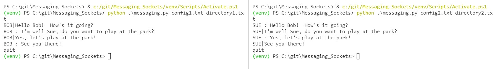

# Messaging with Python Sockets

This is a simple messaging app using a P2P model.  When you run the program, you need to specify a config file and a directory file.

`python messaging.py config.txt directory.txt`

The config file contains the `PORT=####` number you will use to listen for UDP messages.

The directory file contains `NAME=IP,PORT` for all the people that you want to send messages too.

When you want to send a message, type `NAME|Your Message`

When you receive a message, you will see `NAME : Their Message`

No special packages are needed for this program.  The sockets library and socketserver library are used for networking.  To allow the user to send messages and receive messages at the same time, the `serve_forever` function runs in a separate thread.

Useful Websites:

https://docs.python.org/3.6/library/socket.html
https://docs.python.org/3.6/library/socketserver.html

You can test out the program by creating 2 terminals and running the program in each with different config/directory files:

```
python messaging.py config1.txt directory1.txt
python messaging.py config2.txt directory2.txt
```


